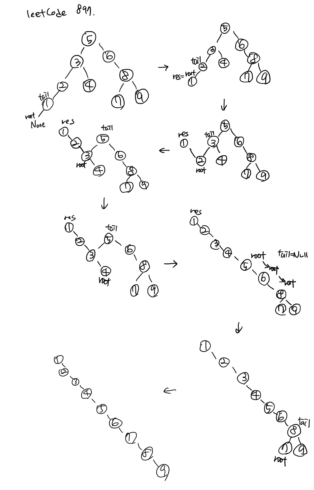

# 897. Increasing Order Search Tree ♻️

## 문제
이진탐색트릐를 왼쪽 노드가 없는 트리로 정렬하는 문제
<br><br>

## 접근방법 1: 중위순회
```python
# Definition for a binary tree node.
# class TreeNode:
#     def __init__(self, val=0, left=None, right=None):
#         self.val = val
#         self.left = left
#         self.right = right
class Solution:
    def increasingBST(self, root: TreeNode, tail = None) -> TreeNode:
        if not root: return tail
        res = self.increasingBST(root.left, root)
        root.left = None
        root.right = self.increasingBST(root.right, tail)
        return res
```
## 결과
```
Runtime: 38 ms
Memory Usage: 13.8 MB
```
-> ```O(n)``` 시간복잡도, ```O(hight)``` 공간복잡도

참고 : https://leetcode.com/problems/increasing-order-search-tree/discuss/165885/C%2B%2BJavaPython-Self-Explained-5-line-O(N)

